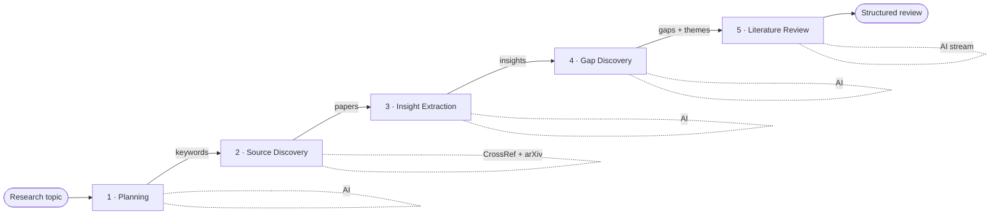

<div align="center">


# LitFlow AI

### Discover what hasn't been researched yet.

An AI-native research copilot that turns a single research topic into a structured
literature review — with a relentless focus on surfacing **research gaps**.

Instead of answering *"what has been researched?"*, LitFlow AI answers
*"what should be researched next?"*

<br />


</div>

---

## Table of contents

- [What is LitFlow AI?](#what-is-litflow-ai)
- [Why it's different](#why-its-different)
- [How it works — the pipeline](#how-it-works--the-pipeline)
- [Step-by-step flow in detail](#step-by-step-flow-in-detail)
- [Architecture](#architecture)
- [Project structure](#project-structure)
- [Getting started](#getting-started)
- [Environment variables](#environment-variables)
- [Deploy to Vercel](#deploy-to-vercel)
- [Tech stack](#tech-stack)

---

## What is LitFlow AI?

Finding the right research direction is hard — and the hard part usually isn't
*finding* papers. It's figuring out:

- What has already been studied to death?
- Which topics are still underexplored?
- Where do existing studies contradict each other?
- Which combinations of ideas has nobody tried yet?

Traditional tools help you **search and read** papers. LitFlow AI helps you
**discover the gaps between them**. You enter one topic, and a guided AI workflow
finds relevant academic papers, extracts their insights, clusters them into
themes, identifies the unexplored territory, and writes a full literature review —
in minutes instead of days.

> **Built for:** undergraduate & graduate students, researchers, and academics —
> plus founders, R&D teams, and innovation/policy researchers scoping new work.

---

## Why it's different

The core innovation is the **Gap Discovery Engine**. Rather than summarizing
papers one at a time, it analyzes the entire corpus *collectively* to find the
white space — the over-researched areas, the under-explored areas, the
contradictions, and the missing combinations — and turns them into concrete,
novel research opportunities.

| Most research tools | LitFlow AI |
|---|---|
| Search & summarize individual papers | Analyze the corpus as a whole |
| "What has been researched?" | "What should be researched next?" |
| Information retrieval | Opportunity discovery |

---

## How it works — the pipeline

LitFlow AI runs a **guided, 5-stage pipeline**. Each stage is its own API route,
so heavy work stays within serverless time limits and any single step can be
retried independently without re-running the whole flow.



Each box is wired to its own endpoint and runs in order — the output of one
stage becomes the input of the next:

| # | Stage | Endpoint | Engine | Output |
|---|---|---|---|---|
| 1 | Research Planning | `POST /api/plan` | AI (JSON) | Research questions, keywords, search strategy |
| 2 | Source Discovery | `POST /api/sources` | CrossRef + arXiv | Ranked, deduped list of papers |
| 3 | Insight Extraction | `POST /api/insights` | AI (1 batched JSON call) | Findings, methodology, limitations per paper |
| 4 | Gap Discovery | `POST /api/gaps` | AI (JSON) | Themes, gaps, contradictions, opportunities |
| 5 | Literature Review | `POST /api/review` | AI (streamed Markdown) | Full structured literature review |

> 💡 The whole run uses only **≈4 AI calls** — insight extraction is batched into
> a single call across all papers — which keeps it fast and friendly to free-tier
> rate limits.

---

## Step-by-step flow in detail

### 1 · Research Planning &nbsp;`/api/plan`

The **Research Planner Agent** takes the raw topic and expands it into a search
plan: **4–6 focused research questions**, **6–10 keywords/phrases**, and a short
**search strategy**. The keywords are what drive the next stage's source search.

<sub>Returns validated JSON (`researchQuestions`, `keywords`, `searchStrategy`).</sub>

### 2 · Source Discovery &nbsp;`/api/sources`

The **Source Discovery Agent** queries two open academic databases **in parallel**
— **CrossRef** and **arXiv** (no API key required) — then:

1. **Merges & dedupes** results (by DOI, falling back to a normalized title).
2. **Prefers papers that actually have abstracts** (the AI needs text to analyze).
3. **Ranks** each paper with a heuristic score combining keyword hits, citation
   count, abstract presence, and recency.
4. **Caps** the list (default 14) so the full corpus fits in one batched AI call.

For each paper it collects: title, authors, abstract, year, citation count,
source, URL, and DOI.

### 3 · Insight Extraction &nbsp;`/api/insights`

The **Insight Extraction Agent** reads every abstract and pulls out structured
insights — **key findings, methodology, contributions, and limitations** — for
each paper. All papers are analyzed in **one batched call** (one insight object
per paper id) to minimize AI usage and latency.

<sub>Everything is grounded strictly in the abstract; missing info is inferred conservatively or left empty.</sub>

### 4 · Gap Discovery &nbsp;`/api/gaps` &nbsp;⭐ the core

This is the heart of LitFlow AI. The **Gap Discovery Agent** analyzes the
extracted insights **collectively** (not paper by paper) and produces:

- **Themes** — papers clustered into 3–5 thematic groups.
- **Over-researched areas** — topics with heavy existing coverage.
- **Under-explored areas** — topics receiving little attention.
- **Contradictions** — studies that reach conflicting conclusions.
- **Missing combinations** — ideas rarely studied together.
- **Opportunities** — concrete, novel research directions, each with a rationale
  and expected contributions.

### 5 · Literature Review &nbsp;`/api/review`

Finally, the **Literature Review Agent** synthesizes the plan, the papers, and
the discovered gaps into a structured review, **streamed token-by-token** as
Markdown so it renders live in the UI. It always produces these sections in order:

> **Introduction** → **Existing Research** → **Research Trends** → **Research Gaps** → **Future Research Directions** → **Conclusion**

Papers are referenced inline as `[n]` against an auto-generated reference list, and
the narrative deliberately emphasizes the discovered gaps and opportunities.

---

## Architecture

```
Browser (Client Component)
  └─ WorkflowRunner ──▶ orchestrates the 5 steps, holds state, handles retries
        │  fetch() per step, streams the final review
        ▼
Next.js App Router (API routes, runtime = nodejs)
  ├─ /api/plan      → generateJSON()  ─┐
  ├─ /api/insights  → generateJSON()   ├─▶ lib/ai.ts ──▶ OpenRouter (chat model)
  ├─ /api/gaps      → generateJSON()  ─┘
  ├─ /api/review    → streamText()    ───▶ streamed Markdown
  └─ /api/sources   → lib/sources ───▶ CrossRef + arXiv (no key needed)
```

A few design decisions worth knowing:

- **Step-per-route.** Each stage is an isolated `POST` route (`runtime = "nodejs"`,
  `maxDuration = 60`) so long AI work never blows the serverless time budget, and
  the UI can retry any single failed step.
- **Resilient JSON.** Free models often wrap JSON in prose or code fences, so
  `lib/ai.ts` extracts the first balanced JSON object, validates it with **Zod**,
  and **retries once** with a stricter "JSON only" instruction if parsing fails.
- **Model-agnostic.** Every agent goes through one OpenRouter model, swappable via
  an env var with **zero code changes**.

---

## Project structure

```
app/
  api/
    plan/route.ts        # Step 1 — research planning (JSON)
    sources/route.ts     # Step 2 — CrossRef + arXiv discovery
    insights/route.ts    # Step 3 — batched insight extraction (JSON)
    gaps/route.ts        # Step 4 — gap discovery (JSON)
    review/route.ts      # Step 5 — streamed literature review
  layout.tsx             # Root layout, fonts, metadata
  page.tsx               # Landing page + topic input
components/
  workflow/              # WorkflowRunner, step cards, progress rail, panels
  ui/                    # shadcn/ui primitives
lib/
  ai.ts                  # OpenRouter client, JSON extraction/repair, streaming
  prompts.ts             # System/user prompts for every agent
  schemas.ts             # Zod schemas + shared types
  sources/               # CrossRef + arXiv clients, merge/dedupe/rank
public/
  litflow-logo.png       # Brand logo
```

---

## Getting started

### Prerequisites

- **Node.js 18.18+** (Node 20+ recommended)
- An **[OpenRouter API key](https://openrouter.ai/keys)** (free tier works)

### Installation

```bash
# 1. Install dependencies
npm install

# 2. Create your local env file and add your key
cp .env.example .env.local      # then set OPENROUTER_API_KEY

# 3. Start the dev server
npm run dev
```

Open **[http://localhost:3000](http://localhost:3000)**, enter a topic
(e.g. *"AI in Sustainable Agriculture"*), and watch the pipeline run.

---

## Environment variables

| Variable | Required | Description |
|---|:---:|---|
| `OPENROUTER_API_KEY` | ✅ | Your OpenRouter key — get one at [openrouter.ai/keys](https://openrouter.ai/keys). |
| `OPENROUTER_MODEL` | – | Model used by all agents. Defaults to `nex-agi/nex-n2-pro:free`. Swap to any OpenRouter model without code changes. |
| `CROSSREF_MAILTO` | – | Contact email sent to CrossRef's "polite" API pool for better reliability. |

> ⚠️ The default model is a **free tier with strict rate limits**. LitFlow AI
> already minimizes AI usage (≈4 calls per run via batching) and repairs malformed
> JSON, but if you hit quota errors, set `OPENROUTER_MODEL` to a paid model.

---

## Deploy to Vercel

1. Push the repo to GitHub and **import it in Vercel**.
2. Add `OPENROUTER_API_KEY` (and optionally `OPENROUTER_MODEL`, `CROSSREF_MAILTO`)
   under **Project → Settings → Environment Variables**.
3. **Deploy** — the App Router and API routes work on Vercel with zero extra config.

---

## Tech stack

**Next.js 16** (App Router) · **React 19** · **TypeScript 5** · **Tailwind CSS v4** ·
**shadcn/ui** · **Vercel AI SDK** · **OpenRouter** · **Zod** · **CrossRef** & **arXiv**

---

<div align="center">


**LitFlow AI** — *the future of research is discovering what comes next.*

</div>
